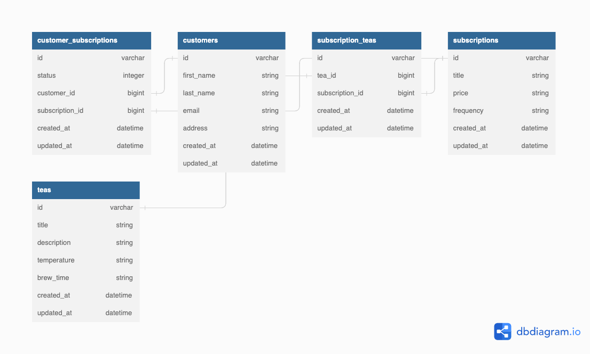

<h1 align="center">Tea Subscription 2208</h1>

  

# Table of Contents
* [App Description](#app-description)
* [Database Schema](#database-schema)
* [System Requirements](#system-requirements)
* [Setup](#setup)
* [Respository](#repository)
* [Endpoints](#endpoints)

<h3>App Description</h3>

Tea-Subscription-2208 is an early-stage tea subscription API-service where a user can get a customer's active and canceled subscriptions, add subscriptions to a customer and cancel a customer's subscription. 

<h3 align="center">Database Schema</h3>

  

<h3>System Requirements</h3>

* Ruby 2.7.4 
* Rails 5.2.8.1
* If the user does not wish to download Ruby/Rails, they can simply download <a href="https://www.docker.com/products/docker-desktop/">Docker Desktop</a> to launch a development container of the app on their local device.

<h3>Setup</h3>

<h4>Setup for Ruby on Rails</h4>

1. Fork and Clone the repository
2. Install gem packages: `bundle install`
4. Setup the database: `rails db:{drop,create,migrate,seed}`
5. Run the server: `rails s`

<h4>Setup for Docker</h4>

1. Fork and Clone the repository
2. Open Docker Desktop and sign in
3. Builder docker image and launch server container: `docker-compose up --build` (You will only have to run `docker-compose up` after this unless you pull a newly updated version of the repository from GitHub)
4. Migrate the database: `docker-compose exec web bundle exec rake db:migrate`
5. Seed data: `docker-compose exec web bundle exec rake db:seed`

<h3>Repository</h3>
https://github.com/efuchsman/tea-subscription-2208

## Contact 

<table align="center">
  <tr>
    <td></td>
  </tr>
  <tr>
    <td>Eli Fuchsman</td>
  </tr>
  <tr>
    <td>
      <a href="https://github.com/efuchsman">GitHub</a> 
      <a href="https://www.linkedin.com/in/elifuchsman/">LinkedIn</a>
   </td>
  </tr>
</table>

<h3><b>Acknowledgements</b></h3>

Turing School of Software Design: [https://turing.edu/](https://turing.edu/)
 

Image Source:

 https://www.forbes.com/sites/lanabandoim/2020/09/24/here-is-why-your-next-cup-of-tea-will-cost-more-money/?sh=1ee194285cf6

